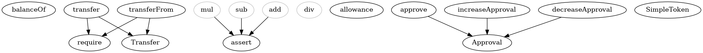
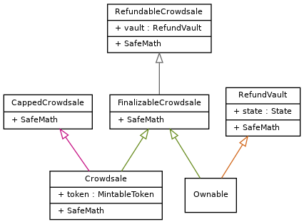
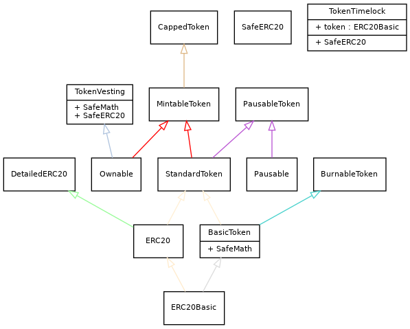

# Ethereum Contract Tools

## Requirements

Node 8+
Solc (solidity compiler)
Solgraph (npm install -g solgraph)

## Installation

`npm install`

## Usage

**Input**

Type the following command into your terminal replacing the parameters:
- **directory** with the directory containing the .sol file (e.g. contracts/somecontractdir)
- **contractname** with the contract filename (minus '.sol')

```bash
make specs dir="directory" contract="contractname"
```

**Outputs**

The above command will output the following:
- flattened contract using [sol-merger]("https://github.com/RyuuGan/sol-merger/) saved in build/merged/**contractname**/
- compiled contract saved in build/compiled/**contractname**/
- markdown documentation using [solmd](https://github.com/dpilch/solmd) saved in build/markdocs/**contractname**.md
- graph of contract functions using [solgraph](https://github.com/raineorshine/solgraph) saved to build/solgraphs/**contractname**.png

**Example**

`make specs dir="contracts/examples" contract="SimpleToken"`

produces the files currently in the subdirectories of build/

**Example solgraph**



**Cleanup**

NOTE: this will remove all files within the build directory and recreate the required subdirectories within the build dir

`npm run cleanup`

-----

## Further Experimental Features

**The following features are available using MakeFile**  
*Please Note: the features in the following section are working as they should be but should still be considered a work in progress.*

### Make GraphDepends

**Example Usage - All Contracts**  
`make graphdepends`

**Example Usage - Contracts Subdirectory**  
`make graphdepends directory="token"`

*directory* = ./contracts/*directory*/  
output file location in ./build/**directory**_flow.png

  

  

-----

### Make Merged

Combines contract imports into a single Solidity file using [sol-merger](https://www.npmjs.com/package/sol-merger)

**Example Usage:**
**`make merged dir="crowdsale" contract="CappedCrowdsale"`**

- Specify the **contract** name and **dir**ectory containing the contract.
- **dir** = subdirectory within contracts directory (optional)
- **contract** = contract to be flattened

**output** file saved to build/merged/**contract**/

```sh
$(shell pwd -P)/node_modules/.bin/sol-merger $(shell pwd -P)/contracts/$(dir)/$(contract).sol $(shell pwd -P)/build/merged/$(contract)
```

or just merge all of them...

-----

### Make Mergeall

The same as **Make Merged** except it is recursive for the selected directory.

**Example Usage:**
**`make mergeall dir="tokens"`**

- ./contracts/**dir**/
- **dir** = subdirectory within contracts directory (optional)

**output** files saved to build/merged/

```sh
$(shell pwd -P)/node_modules/sol-merger/bin/sol-merger.js "$(shell pwd -P)/contracts/$(dir)/*.sol" build/merged/$(dir)
```

-----

### Make Solgraph

Graph Single Contract as .PNG using Solgraph

**Example Usage:**
**`make graphpng dir="crowdsale" contract="CappedCrowdsale"`**

- ./contracts/**dir**/**contract**
- **dir** = subdirectory within contracts directory (optional)
- **contract** = contract name to create Solgraph

**output** file saved to ./build/solgraphs/**contract**/

```sh
$(shell pwd -P)/node_modules/.bin/solgraph $(shell pwd -P)/contracts/$(dir)/$(contract).sol | dot -Tpng > $(shell pwd -P)/build/temp/$(contract).png

cp $(shell pwd -P)/build/temp/$(contract).png $(shell pwd -P)/build/solgraphs/$(contract).png

rm $(shell pwd -P)/build/temp/$(contract).png
```


-----

### Make Treemap

documentation coming soon


### make treespec

documentation coming soon

## Issues

If something isn't working, you have a question, or you need assistance, please feel free to open an issue.

## Contributing

Pull requests are welcome. For major changes, please open an issue first to discuss what you would like to change.

## License

[MIT](https://choosealicense.com/licenses/mit/)