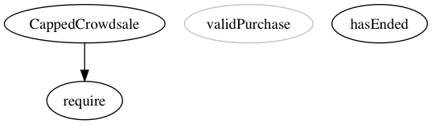
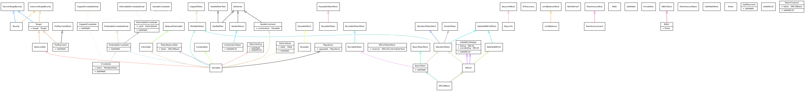

# Ethereum Contract Development Toolbox

Various tools used for Solidity smart-contract development.

-----

The following features are available using MakeFile

## Make Merged - Flatten/Merge Contract Imports

Combines contract imports into a single Solidity file using [sol-merger](https://www.npmjs.com/package/sol-merger)

**Example Usage:**
**`make merged dir="crowdsale" contract="CappedCrowdsale"`**

*dir* = ./contracts/*dir*/  
*contract* = contract name to be flattened  
*output* file saved: ./build/merged/*contract*/  

```sh
$(shell pwd -P)/node_modules/.bin/sol-merger $(shell pwd -P)/contracts/$(dir)/$(contract).sol $(shell pwd -P)/build/merged/$(contract)
```

-----

### make graphpng

*Graph Single Contract as .PNG*

**Example Usage:**
`make graphpng dir="crowdsale" contract="CappedCrowdsale"`

*dir* = ./contracts/*dir*/  
*contract* = contract  for solgraph  
output file location in ./build/solgrpahs/*contract*.png  



-----

### make graphrec


**Example Usage - All Contracts**
`make graphrec`

**Example Usage - Contracts Subdirectory**
`make graphrec directory="Token"'

*directory* = ./contracts/*directory*/
output file location in ./build/solgrpahs/*contract*.png


Contracts Directory Recursive Overview


-----

make treemap


-----
make treespec


-----
make compile


**WIP**

##Useful Commands

compile
`solc --optimize --abi --bin --metadata contract.sol`

solgraph clipboard to preview (OSX)
`pbpaste | solgraph | dot -Tpng | open -f -a /Applications/Preview.app`