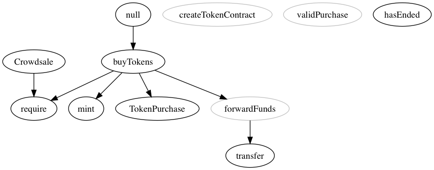
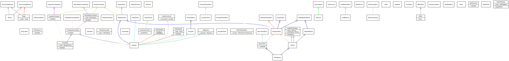

# Ethereum Contract Development Toolbox

## Get started

`npm install`

-----
## Commands

**Flatten/Merge Contract Imports**
```sh
make build-contracts dir="crowdsale" contract="CappedCrowdsale"


**
dir = contracts/*yourpathhere*
contract = contract name to be flattened
**
```
Outputs to .build/merged/*ContractName*

---

**Graph Single Contract as .PNG**

```sh
make graphpng dir="crowdsale" contract="CappedCrowdsale"

**
dir = contracts/*yourpathhere*
contract = contract name to be flattened
**
```



-----

Contracts Directory Recursive Overview

```sh
make graphrec
```



-----

**Sub-Directory Overview**

```sh
make graphrec directory="Token"
```


-----

make treemap


-----
make treespec


-----
make compile


**WIP**

##Useful Commands

compile
`solc --optimize --abi --bin --metadata contract.sol`

solgraph clipboard to preview (OSX)
`pbpaste | solgraph | dot -Tpng | open -f -a /Applications/Preview.app`